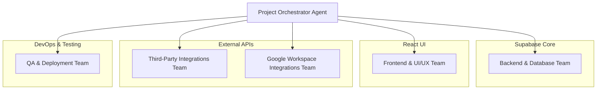

# mFunding SaaS Platform: Claude Code Agent Team Architecture

**Author:** Manus AI
**Client:** mFunding.com
**Document Version:** 1.0
**Date:** March 01, 2026
**Project Stack:** React (Frontend), Supabase (Backend), GoHighLevel (Core CRM), Desktop-First Responsive Design

---

## 1. Introduction

This document outlines the recommended agent team structure for building the **mFunding SaaS Platform** using a Claude Code agent-based development methodology. The architecture is designed to parallelize workstreams, ensure specialized expertise is applied to each domain of this complex project, and provide a clear command structure for efficient execution. The goal is to translate the detailed Product Requirements Document (PRD) v1.1 into a fully functional, production-ready application.

## 2. Core Development Philosophy: Team of Teams

The project will be managed using a "Team of Teams" approach. A central **Orchestrator Agent** acts as the project manager, breaking down the PRD into discrete tasks and coordinating the efforts of several specialized, autonomous agent teams. Each team has a clear mandate and owns a specific vertical of the application, from the database schema to the user-facing components.

This structure allows for concurrent development. For example, the Frontend Team can build UI components using mock data while the Backend and Integrations Teams build out the underlying APIs.

## 3. High-Level Agent Team Structure

The development process will be divided among five primary agent teams, all coordinated by a single Project Orchestrator.

---

## 4. Detailed Agent Team Roles & Responsibilities

### 4.1. Project Orchestrator Agent

The **Project Orchestrator Agent** is the master conductor of the entire development process. It does not write code but instead translates the PRD into an actionable project plan and ensures all other teams are working in concert.

*   **Role:** Project Manager & Systems Architect.
*   **Responsibilities:**
    *   Ingest the mFunding SaaS PRD (v1.1) and create a detailed project backlog (e.g., as a series of GitHub Issues).
    *   Decompose high-level features into specific, actionable tasks for each agent team.
    *   Define the API contracts and data schemas that each team will use to communicate.
    *   Manage dependencies between teams (e.g., the Frontend Team cannot build the deal view until the Backend Team defines the deal data structure).
    *   Conduct code reviews and merge pull requests to ensure quality and consistency.
    *   Triage bugs and assign them to the appropriate team for resolution.
    *   Provide regular progress updates based on the completion of tasks.

### 4.2. Backend & Database Team (Supabase Specialists)

This team is responsible for building the entire backend logic and database structure on the Supabase platform. They own the data model and the server-side business logic of the Lending Operations Core.

*   **Team Lead:** **Supabase Architect Agent**
*   **Key Technologies:** Supabase, PostgreSQL, Deno/TypeScript, PostgREST

| Agent Role | Responsibilities |
| :--- | :--- |
| **Database Schema Agent** | Translates the PRD Data Model into a robust PostgreSQL schema. Writes SQL scripts to create tables, define relationships (foreign keys), set constraints, and create database views. | 
| **Row-Level Security (RLS) Agent** | Implements all security and data access policies directly in the database using Supabase RLS. Writes the SQL security policies that ensure a user (e.g., a Sub-ISO Agent) can only see and modify their own data. This is critical for the multi-tenant architecture. | 
| **Authentication Agent** | Configures and manages user identity using Supabase Auth. Implements the role-based access control (RBAC) system defined in the PRD, linking database roles to authenticated users. Manages JWT handling and session logic. | 
| **Edge Functions Agent** | Writes the server-side business logic as TypeScript/Deno functions deployed on Supabase Edge Functions. This includes the core logic for deal creation, underwriting calculations, commission calculations, and orchestrating calls to the Third-Party Integrations Team. | 

### 4.3. Frontend & UI/UX Team (React Specialists)

This team is responsible for building the entire user-facing web application. Their focus is on creating a clean, responsive, and intuitive user experience, prioritizing a robust desktop view that adapts seamlessly to mobile devices.

*   **Team Lead:** **UI/UX Architect Agent**
*   **Key Technologies:** React, Next.js, Tailwind CSS, Zustand/React Query

| Agent Role | Responsibilities |
| :--- | :--- |
| **UI/UX Design Agent** | Translates the PRD portal requirements into high-fidelity wireframes and mockups. Defines the component library, color palette, typography, and overall design system. Ensures all designs are desktop-first but include clear guidance for mobile responsiveness. | 
| **Component Library Agent** | Builds the library of reusable React components based on the UI/UX designs (e.g., `<DataTable>`, `<KanbanCard>`, `<Modal>`, `<DatePicker>`). Uses a tool like Storybook to document and test components in isolation. | 
| **Application Scaffolding Agent** | Sets up the Next.js project, configures routing, and builds the main application layout (navigation, sidebars, headers). Implements the user-facing authentication flow, connecting to the Supabase backend. | 
| **State Management Agent** | Manages the application's client-side state. Uses React Query to fetch, cache, and synchronize data from the Supabase backend, and a tool like Zustand for managing global UI state (e.g., open modals, notifications). | 

### 4.4. Third-Party Integrations Team (Financial API Specialists)

This team is responsible for the most complex and critical part of the application: communicating with all external APIs. They will build a dedicated client/SDK for each third-party service, abstracting the complexity away from the rest of the application.

*   **Team Lead:** **Lead Integration Engineer Agent**
*   **Key Technologies:** Node.js/TypeScript, Axios/Fetch, REST, OAuth 2.0

| Agent Role | Responsibilities |
| :--- | :--- |
| **GoHighLevel (GHL) Sync Agent** | Owns the entire GHL integration. Implements the two-way synchronization of Contacts and Opportunities, triggers GHL workflows, and manages the provisioning of new sub-ISO sub-accounts via the GHL REST API v2. | 
| **Plaid Integration Agent** | Builds the complete Plaid workflow. Implements the Plaid Link frontend component, handles the secure token exchange, and creates services to call the Plaid API for Auth, Identity, Transactions, and Assets data. | 
| **eSignature Integration Agent** | Implements the chosen eSignature API (e.g., DocuSign, SignNow). Builds the services for dynamic contract generation, creating signing envelopes, handling the embedded signing ceremony, and processing status webhooks. | 
| **Financial Data Agent** | Integrates with all other financial data APIs, including credit bureaus (Experian), risk intelligence platforms (DataMerch), and ACH processors (Payliance). |

### 4.5. Google Workspace Integrations Team (Google API Specialists)

This team is dedicated to building the full suite of integrations with Google Workspace, turning the mFunding platform into a true productivity hub.

*   **Team Lead:** **Google Workspace Architect Agent**
*   **Key Technologies:** Google APIs (Gmail, Calendar, Drive, etc.), OAuth 2.0, Node.js/TypeScript

| Agent Role | Responsibilities |
| :--- | :--- |
| **Google Auth Agent** | Implements the entire Google OAuth 2.0 flow. Manages token storage, refresh logic, and the user-facing consent screen process. Ensures all Google API calls are properly authenticated on behalf of the user. |
| **Gmail & People Sync Agent** | Builds the two-way synchronization for Gmail and Google Contacts. Uses the Gmail API to read and send emails and the People API to manage contacts. |
| **Drive & Docs Agent** | Creates the automated folder structure in Google Drive and manages file synchronization. Uses the Google Docs API to create and manage collaborative underwriting notes. |
| **Calendar & Tasks Agent** | Integrates with the Google Calendar and Tasks APIs to create events and manage to-do lists for agents, triggered by actions within the mFunding platform. |
| **Sheets & Meet Agent** | Builds the "Export to Sheets" functionality and the live dashboard feature using the Google Sheets API. Implements the one-click "Start a Meeting" feature using the Google Meet API. |

### 4.6. QA & Deployment Team (DevOps Specialists) 

### 4.5. QA & Deployment Team (DevOps Specialists)

This team is responsible for ensuring the quality, stability, and continuous delivery of the platform.

*   **Team Lead:** **QA & DevOps Lead Agent**
*   **Key Technologies:** Jest, React Testing Library, Cypress, GitHub Actions, Vercel/AWS

| Agent Role | Responsibilities |
| :--- | :--- |
| **Unit & Integration Test Agent** | Writes unit tests (Jest) for individual functions and integration tests for API endpoints and services. Ensures that the core business logic and API integrations work as expected. | 
| **End-to-End (E2E) Test Agent** | Writes automated E2E tests using a framework like Cypress. These tests simulate real user workflows (e.g., "a Sub-ISO Agent submits a deal, it appears in the pipeline, and a notification is sent") to catch regressions. | 
| **CI/CD Pipeline Agent** | Configures the Continuous Integration/Continuous Deployment pipeline using GitHub Actions. Automates the process of running tests, building the application, and deploying it to staging and production environments (e.g., on Vercel or AWS). | 
| **Infrastructure & Monitoring Agent** | Manages the cloud infrastructure. Sets up logging, monitoring, and alerting to ensure the platform is stable and performant in production. | 
